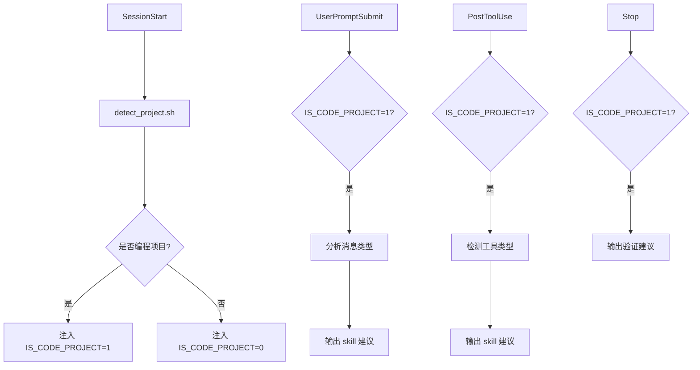

# Trae Hooks 自动调用 Skills 设计文档

**创建时间**: 2026-07-12
**状态**: 设计完成
**目标**: 为编程类项目设计 Trae hooks 自动建议调用 skills 的机制，提高任务完成质量

---

## 1. 背景

用户在 Trae IDE 中进行编程任务时，经常需要手动调用各种 skills（如 `brainstorming`、`verification-before-completion`、`test-driven-development` 等）来提高任务质量。为了减少手动操作，设计一套基于 Trae hooks 系统的自动建议机制。

### 1.1 目标 Skills

- `brainstorming` — 创建功能/组件前的设计讨论
- `verification-before-completion` — 任务完成前的验证
- `finishing-a-development-branch` — 开发分支完成时
- `dispatching-parallel-agents` — 并行任务时
- `executing-plans` — 执行计划时
- `using-superpowers` — 使用 superpowers 时
- `writing-skills` — 创建 skills 时
- `requesting-code-review` — 请求代码审查时
- `subagent-driven-development` — 子代理驱动开发时
- `test-driven-development` — TDD 时
- `systematic-debugging` — 系统性调试时

---

## 2. 核心设计决策

### 2.1 工作区类型检测

**方案**: 基于 SessionStart 时检测工作区是否包含代码文件

**判断逻辑**:
- 检查工作区是否包含常见的代码文件模式：
  - `.py`, `.js`, `.ts`, `.go`, `.java`, `.rs`, `.cpp`, `.c`, `.h`
  - `package.json`, `go.mod`, `Cargo.toml`, `pom.xml`, `build.gradle`
  - `.git/`, `.github/` 目录
- 如果检测到代码文件，注入环境变量 `IS_CODE_PROJECT=1`
- 否则注入 `IS_CODE_PROJECT=0`

**优点**:
- 简单可靠，不依赖用户消息内容分析
- 覆盖所有编程语言和技术栈
- 易于维护和扩展

### 2.2 触发时机

**全部启用以下事件**:

| 事件 | 触发时机 | 作用 |
|------|---------|------|
| SessionStart | 会话开始时 | 检测项目类型，注入环境变量 |
| UserPromptSubmit | 用户发送消息后 | 分析消息类型，建议相应 skills |
| PostToolUse | 工具调用后 | 检测代码修改，建议相应 skills |
| Stop | 智能体准备停止时 | 建议验证流程 |

### 2.3 调用方式

**方案**: 附加上下文方式

**实现**:
- hooks 输出纯文本建议（如"建议：检测到功能创建请求，建议先调用 brainstorming skill"）
- 模型自己决定是否调用 skill
- 不强制拦截，保持智能体自主性

**优点**:
- 不干扰智能体正常工作流程
- 用户可以看到建议，但不会被强制
- 实现简单，易于调试

### 2.4 判断粒度

**方案**: 简单判断

**实现**:
- 只区分"编程项目"和"非编程项目"
- 所有编程项目使用同一套 hooks 逻辑
- 不细分项目类型（如 Python 项目、Web 项目等）

**优点**:
- 配置简洁，易于维护
- 覆盖面广，不遗漏边界情况
- 减少误判风险

---

## 3. 架构设计

### 3.1 目录结构

```
~/.trae-cn/
├── hooks.json                    # 主配置文件
└── hooks/                        # Hook 脚本目录
    ├── detect_project.sh         # 检测编程项目
    ├── session_start.sh          # SessionStart 处理
    ├── user_prompt_submit.sh     # UserPromptSubmit 处理
    ├── post_tool_use.sh          # PostToolUse 处理
    └── stop_handler.sh           # Stop 处理
```

### 3.2 工作流程



---

## 4. 配置设计

### 4.1 hooks.json

```json
{
  "version": 1,
  "hooks": {
    "SessionStart": [
      {
        "hooks": [
          {
            "command": "bash ~/.trae-cn/hooks/session_start.sh",
            "timeout": 10
          }
        ]
      }
    ],
    "UserPromptSubmit": [
      {
        "hooks": [
          {
            "command": "bash ~/.trae-cn/hooks/user_prompt_submit.sh",
            "timeout": 5
          }
        ]
      }
    ],
    "PostToolUse": [
      {
        "matcher": "Write|Edit",
        "hooks": [
          {
            "command": "bash ~/.trae-cn/hooks/post_tool_use.sh",
            "timeout": 5
          }
        ]
      }
    ],
    "Stop": [
      {
        "loop_limit": 3,
        "hooks": [
          {
            "command": "bash ~/.trae-cn/hooks/stop_handler.sh",
            "timeout": 10
          }
        ]
      }
    ]
  }
}
```

---

## 5. Shell 脚本设计

### 5.1 detect_project.sh — 检测编程项目（被 session_start.sh 调用）

```bash
#!/bin/bash
# 检测是否为编程项目（内部函数，返回 0/1）

detect_code_project() {
  local CODE_PATTERNS="*.py *.js *.ts *.go *.java *.rs *.cpp *.c *.h package.json go.mod Cargo.toml pom.xml build.gradle"
  
  for pattern in $CODE_PATTERNS; do
    if find "$TRAE_PROJECT_DIR" -name "$pattern" -type f 2>/dev/null | head -n 1 | grep -q .; then
      return 1  # 找到代码文件
    fi
  done
  
  # 也检查 .git 和 .github 目录
  if [ -d "$TRAE_PROJECT_DIR/.git" ] || [ -d "$TRAE_PROJECT_DIR/.github" ]; then
    return 1
  fi
  
  return 0  # 未找到代码文件
}
```

### 5.2 session_start.sh — 会话开始处理（主入口）

```bash
#!/bin/bash
# SessionStart 处理（主入口）

# 加载检测函数
source ~/.trae-cn/hooks/detect_project.sh

# 检测项目类型
detect_code_project
FOUND_CODE=$?

# 注入环境变量供后续 Hook 使用
if [ $FOUND_CODE -eq 1 ]; then
  echo "export IS_CODE_PROJECT=1" >> "$TRAE_ENV_FILE"
  echo "检测到编程项目，已启用 skills 自动建议功能。"
  echo "建议：可调用 using-superpowers skill 以获得更好的 skills 支持。"
else
  echo "export IS_CODE_PROJECT=0" >> "$TRAE_ENV_FILE"
fi
```

### 5.3 user_prompt_submit.sh — 用户消息提交处理

```bash
#!/bin/bash
# UserPromptSubmit 处理

# 读取 stdin JSON
read -r stdin_json
PROMPT=$(echo "$stdin_json" | jq -r '.prompt')

# 检查是否为编程项目
if [ "$IS_CODE_PROJECT" != "1" ]; then
  exit 0
fi

# 分析用户消息类型
if echo "$PROMPT" | grep -qiE "创建|添加|实现|开发|构建|设计"; then
  echo "建议：检测到功能创建请求，建议先调用 brainstorming skill 进行设计讨论。"
elif echo "$PROMPT" | grep -qiE "修复|bug|错误|问题|调试"; then
  echo "建议：检测到问题修复请求，建议使用 systematic-debugging skill 进行系统性调试。"
elif echo "$PROMPT" | grep -qiE "测试|单元测试|集成测试"; then
  echo "建议：检测到测试相关请求，建议使用 test-driven-development skill。"
elif echo "$PROMPT" | grep -qiE "审查|review|重构"; then
  echo "建议：检测到代码审查/重构请求，建议使用 requesting-code-review skill。"
fi
```

### 5.4 post_tool_use.sh — 工具调用后处理

```bash
#!/bin/bash
# PostToolUse 处理

# 读取 stdin JSON
read -r stdin_json
TOOL_NAME=$(echo "$stdin_json" | jq -r '.tool_name')
TOOL_INPUT=$(echo "$stdin_json" | jq -r '.tool_input')

# 检查是否为编程项目
if [ "$IS_CODE_PROJECT" != "1" ]; then
  exit 0
fi

# 检测测试文件修改
if [ "$TOOL_NAME" = "Write" ] || [ "$TOOL_NAME" = "Edit" ]; then
  FILE_PATH=$(echo "$TOOL_INPUT" | jq -r '.file_path // .path')
  if echo "$FILE_PATH" | grep -qE "test_|_test\.|\.test\.|spec_|_spec\."; then
    echo "建议：检测到测试文件修改，建议遵循 TDD 流程，先运行测试验证。"
  fi
fi
```

### 5.5 stop_handler.sh — 停止处理

```bash
#!/bin/bash
# Stop 处理

# 读取 stdin JSON
read -r stdin_json
LAST_MESSAGE=$(echo "$stdin_json" | jq -r '.last_assistant_message')

# 检查是否为编程项目
if [ "$IS_CODE_PROJECT" != "1" ]; then
  exit 0
fi

# 建议验证流程
echo "建议：任务完成前，建议调用 verification-before-completion skill 验证测试通过、代码质量等。"
```

---

## 6. AskUserQuestion 使用建议

### 6.1 核心要求（用户明确指定）

> **不要每次让我问问题的时候都停下来，直接用那个对话栏问我就行了，不要每次都停下来。**

**具体含义**:
- 执行过程中需要提问时，**不要停下来等待用户回答**
- 应使用 **AskUserQuestion 工具** 在对话栏直接提问
- 提问后继续执行，**不要中断流程**
- 让用户在对话栏直接选择或输入答案，而不是每次都停下等待

### 6.2 设计原则

- **不中断流程**: 使用 AskUserQuestion 工具直接在对话栏提问，而不是停下来等待
- **减少轮次**: 一次提问最多 1-4 个问题，避免过多轮次
- **智能时机**: 只在真正需要用户决策时提问，避免在简单场景滥用
- **对话栏交互**: 所有提问都通过 AskUserQuestion 工具在对话栏完成，用户无需离开当前界面

### 6.3 集成方式

由于 hooks 只能输出文本，不能直接调用 AskUserQuestion 工具，因此：

- hooks 通过附加上下文建议模型使用 AskUserQuestion 工具
- 例如：`"建议：当遇到多个可选方案时，使用 AskUserQuestion 工具让用户选择。"`
- 模型根据建议决定是否调用 AskUserQuestion

### 6.4 示例场景

**场景 1: 用户请求创建功能**
- Hook 输出: "建议：检测到功能创建请求，建议先调用 brainstorming skill 进行设计讨论。"
- 模型决定: 调用 brainstorming skill → 在 brainstorming 过程中使用 AskUserQuestion 收集需求

**场景 2: 用户请求修复 bug**
- Hook 输出: "建议：检测到问题修复请求，建议使用 systematic-debugging skill 进行系统性调试。"
- 模型决定: 调用 systematic-debugging skill → 在调试过程中使用 AskUserQuestion 确认修复方案

---

## 7. 预期效果

### 7.1 用户体验改进

- **减少手动操作**: 不需要每次手动调用 skills
- **智能提示**: 根据上下文自动建议合适的 skills
- **保持自主性**: 模型可以忽略建议，不会被强制拦截

### 7.2 任务质量提升

- **设计先行**: 新功能创建前自动建议 brainstorming
- **验证完成**: 任务完成前自动建议 verification-before-completion
- **调试系统化**: 问题修复时自动建议 systematic-debugging

### 7.3 工作效率提高

- **减少遗漏**: 避免忘记调用关键 skills
- **流程标准化**: 引导遵循最佳实践（如 TDD、code review）
- **上下文感知**: 只在编程项目中触发，不影响普通对话

---

## 8. 后续扩展

### 8.1 可扩展点

- **更多 skills**: 根据使用反馈添加更多 skills 建议
- **项目类型细分**: 未来可以根据项目类型（Python/Web/微服务等）提供更精准的建议
- **学习机制**: 记录用户的 skill 调用习惯，个性化建议

### 8.2 维护策略

- **脚本更新**: 定期更新检测逻辑，支持新的编程语言和框架
- **关键词优化**: 根据用户反馈优化消息类型匹配的关键词
- **性能监控**: 监控 hooks 执行时间，避免影响用户体验

---

## 9. 总结

本设计通过 Trae hooks 系统，在 SessionStart、UserPromptSubmit、PostToolUse、Stop 四个关键时机，自动检测编程项目并建议调用相应 skills。采用"附加上下文"的轻量方式，既提供了智能提示，又保持了智能体的自主性。预期可以显著提高编程任务的完成质量，减少手动操作，提升工作效率。